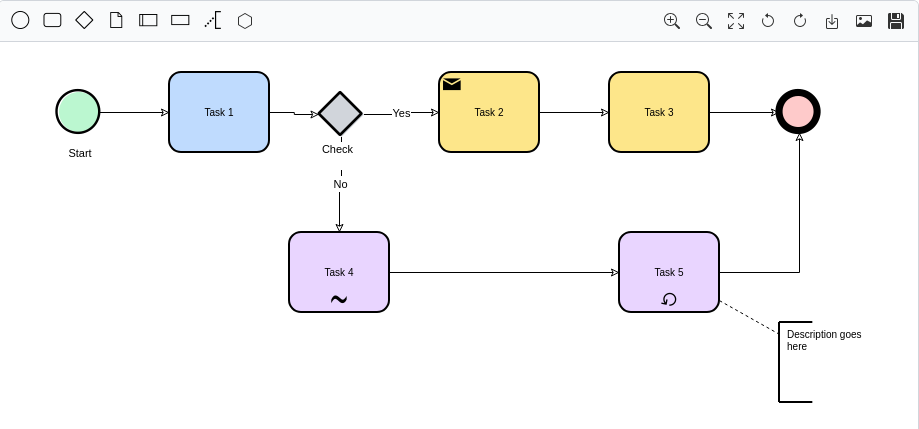

# bpmn-editor

A [BPMN](https://www.omg.org/spec/BPMN/) diagram editor you can drop into any page — agnostic of UI framework and backend, built on [`@maxgraph/core`](https://www.npmjs.com/package/@maxgraph/core).

[](https://www.npmjs.com/package/@sourcentis/bpmn-editor)
[](https://github.com/sourcentis/bpmn-editor/blob/main/LICENSE)



---

## What this is (and isn't)

`@sourcentis/bpmn-editor` doesn't assume React/Vue/Angular, and it doesn't
assume a server. But it is **not** dependency-free: it's built on
`@maxgraph/core`, its rendering engine, installed alongside it as a peer
dependency.

- **Not swappable** — `@maxgraph/core` does all the actual drawing. The
  editor is built on it, the same way a chart library is "built on" Canvas.
- **Swappable (and optional)** — everything backend-shaped (loading a
  catalogue of objects to link to, saving to a server) is expressed as
  small, optional TypeScript interfaces ("ports") that *you* implement.
  Provide none of them and the editor still works fully standalone: draw,
  import a `.bpmn`/XML file, export it back out.

## Features

- **Full BPMN-ish drawing surface**: tasks, states/events, gateways, data
  objects/stores, lanes, activities groups, annotations, conversations,
  sequence/message/conditional/default flows — drag-and-drop from a palette,
  connect, recolor, rotate, undo/redo.
- **Import / export** `.bpmn`/XML files — works with zero backend.
- **Export to SVG**, with the BPMN icon font embedded so the file renders
  correctly outside the browser.
- **Read-only "viewer" mode** (`readOnly: true`): disables editing, keeps
  pan/zoom, and turns clicks on linked elements into a `navigate` event.
- **Two integration levels**: a batteries-included default toolbar
  (`ui: 'default'`), or canvas-only (`ui: 'none'`) so a host application can
  drive everything through the instance API with its own UI.
- **Optional backend ports** — see the [backend integration
  guide](guides/backend-integration.md).
- **i18n-ready** — every user-facing string is overridable, see the
  [i18n guide](guides/i18n.md).
- **Self-contained**: the BPMN icon font and every toolbar/menu icon are
  bundled and inlined at build time — no extra `<link>`, no separate CSS.
- **Multi-instance safe**: mount as many editors as you want on one page.
- **CSP-safe** — see [Security / CSP](security.md).

## Installation

```bash
npm install @sourcentis/bpmn-editor @maxgraph/core
```

`@maxgraph/core` is a peer dependency — install it explicitly alongside the
editor.

## Quick start

```html
<div id="editor" style="height: 640px;"></div>

<script type="module">
  import { createBpmnEditor } from '@sourcentis/bpmn-editor';

  const editor = createBpmnEditor(document.getElementById('editor'), {
    ui: 'default',
  });
</script>
```

That's it — a complete BPMN editor with a toolbar, drag-and-drop palette,
undo/redo, and import/export, with no server and no other setup.

## Live examples

Both examples below run entirely client-side, loaded from the published npm
package via a CDN — the same code as
[`examples/editor.html`](https://github.com/sourcentis/bpmn-editor/blob/main/examples/editor.html)
and
[`examples/viewer.html`](https://github.com/sourcentis/bpmn-editor/blob/main/examples/viewer.html)
in the repository.

<script type="importmap">
{
  "imports": {
    "@maxgraph/core": "https://esm.sh/@maxgraph/core@0.21.0",
    "@sourcentis/bpmn-editor": "https://cdn.jsdelivr.net/npm/@sourcentis/bpmn-editor@latest/dist/bpmn-editor.js"
  }
}
</script>

### Editor (`ui: 'default'`)

Full toolbar, drag-and-drop palette, undo/redo, import/export — everything
enabled. No `provider` and no `persistence` configured, so **Save**
downloads a local `.maxgraph` file. Try dragging a shape from the palette, or
use Import/Export in the toolbar.

<div id="doc-editor" style="height: 560px; border: 1px solid #e1e4e5; border-radius: 4px; margin: 16px 0;"></div>

<script type="module">
  import { createBpmnEditor } from '@sourcentis/bpmn-editor';

  const editorEl = document.getElementById('doc-editor');
  const editor = createBpmnEditor(editorEl, { ui: 'default' });
  editor.on('error', (err) => console.error('[bpmn-editor]', err));

  fetch('sample.bpmn')
    .then((res) => res.text())
    .then((xml) => editor.loadXml(xml))
    .catch((err) => console.error('[bpmn-editor] could not load sample.bpmn', err));
</script>

### Viewer (`ui: 'none'` + `readOnly: true`)

Canvas only, no toolbar, no editing — pan and mouse-wheel zoom still work.
This is the read-only mode used to embed a diagram for browsing rather than
editing.

<div id="doc-viewer" style="border: 1px solid #e1e4e5; border-radius: 4px; margin: 16px 0;"></div>

<script type="module">
  import { createBpmnEditor } from '@sourcentis/bpmn-editor';

  const viewerEl = document.getElementById('doc-viewer');
  const viewer = createBpmnEditor(viewerEl, {
    ui: 'none',
    readOnly: true,
    onNavigate: (url) => { window.location.href = url; },
  });
  viewer.on('error', (err) => console.error('[bpmn-editor]', err));

  fetch('sample.bpmn')
    .then((res) => res.text())
    .then((xml) => viewer.loadXml(xml))
    .catch((err) => console.error('[bpmn-editor] could not load sample.bpmn', err));
</script>

## Ports (optional backend integration)

Two small interfaces let the editor talk to a backend without knowing
anything about it — both entirely optional, and covered in detail in the
[backend integration guide](guides/backend-integration.md):

- **`BpmnObjectProvider`** — powers the "insert cartography object" search
  inside the contextual menu. Without it, that action is simply hidden.
- **`BpmnPersistence`** — powers the `ui: 'default'` toolbar's "Save"
  action. Without it, "Save" downloads a local `.maxgraph` file instead.

## Instance API

```ts
const editor = createBpmnEditor(container, options);
```

| Method | Description |
|---|---|
| `loadXml(xml)` | Replaces the current graph with the given editor-format XML. |
| `getXml()` | Serializes the current graph. |
| `importBpmnXml(xml)` | Replaces the graph by parsing standard BPMN 2.0 XML. |
| `exportBpmnXml()` | Serializes the graph as standard BPMN 2.0 XML — the counterpart of `importBpmnXml()`. |
| `setEnabled(enabled)` | Toggles editing on/off at runtime. |
| `exportSvg(filename?)` | Exports to SVG and triggers a download. |
| `zoomIn()` / `zoomOut()` / `fit()` | Viewport controls. |
| `on(event, handler)` / `off(event, handler)` | Subscribe/unsubscribe. |
| `destroy()` | Tears down the instance and removes every listener it added. |

See the [API reference](api-reference.md) for the full options list, event
payloads, and message keys.

## Next steps

- [Vanilla JS / HTML guide](guides/vanilla-js.md) — no backend, no build step
- [Backend integration guide](guides/backend-integration.md) — implement the
  `provider`/`persistence` ports against a real API, with a full worked
  example (Mercator)
- [i18n guide](guides/i18n.md) — translate every user-facing string
- [Assets guide](guides/assets.md) — what's bundled and how to override the
  export font
- [API reference](api-reference.md) — full options, events, and types
- [Security / CSP](security.md)

## License

[GPL-3.0](https://github.com/sourcentis/bpmn-editor/blob/main/LICENSE)
